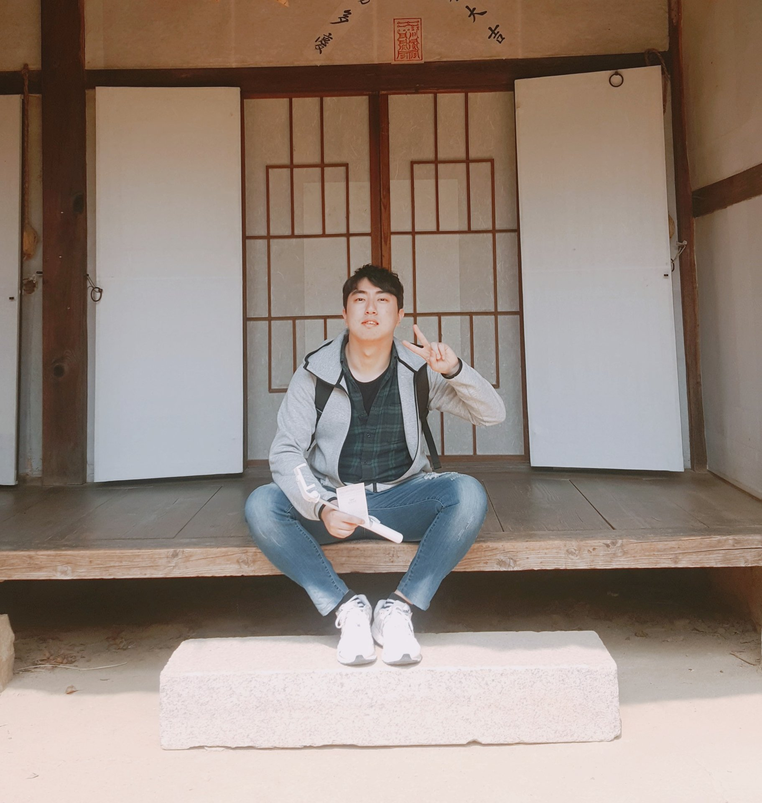

{: width="400" height="600"}

**M.S. Student** Korea University Mechanical Engineering Korea Institute of Science and Technology Center for Robotics Research

### Contact

Email : choitm0707@kist.re.kr Office :  L8401, International Cooperation Building, KIST(Korea Institute of Science and Technology) Phone : +82-2-958-6815

### Research Interests

- Semantic Mapping
- [Social Navigation](https://github.com/Taemin0707/social_navigation)

### Education

- B.S. in Mechanical Engineering and Global Technology Management(Dual Major) at Seoul National University of Science and Technology(2018)

### Publications